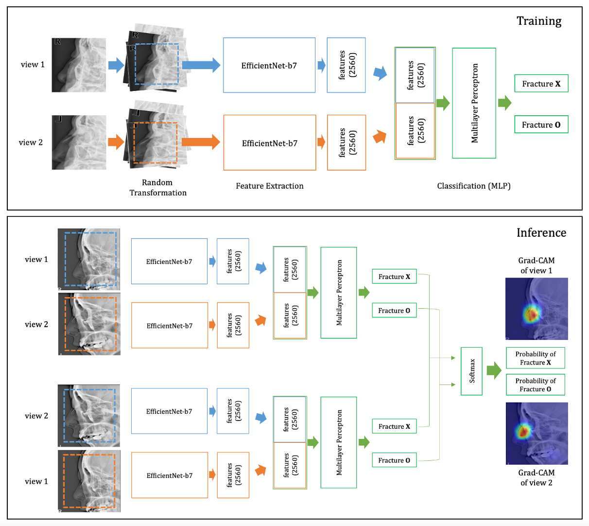
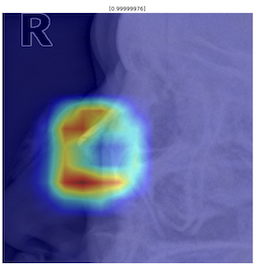

# nasalbone fracture detection 

## background
Nasal bone fractures are the most common fractures of the facial bones, accounting for up to 50% of all incidences. Moreover, they represent the third most common bone fracture overall. Considering the benefits of low radiation exposure as well as cost-effectiveness and accessibility, plain nasal radiography remains the initial diagnostic tool for screening simple nasal bone fractures. This study aimed to assess the performance of deep learning algorithms in the diagnosis of nasal bone fractures on radiographs and compare it with that of experienced radiologists.

For more information, please read the following paper:
Nam, Y., Choi, Y., Kang, J., Seo, M., Heo, S. J., & Lee, M. K. (2022). Diagnosis of nasal bone fractures on plain radiographs via convolutional neural networks. Scientific Reports, 12(1), 1-9. [DOI](https://doi.org/10.1038/s41598-022-26161-7)

## proposed model

## instructions (inference)
- Two lateral views are required as input.
- You can downlad the model below and test it with your own input.
- [download](https://hufs365-my.sharepoint.com/:u:/g/personal/yoonhonam_o365_hufs_ac_kr/EWM0WKKmwVlOrXa4RQfURYEBqvhitqFxNiEN_wjfoJrdfA)

## sample of results

## citation
